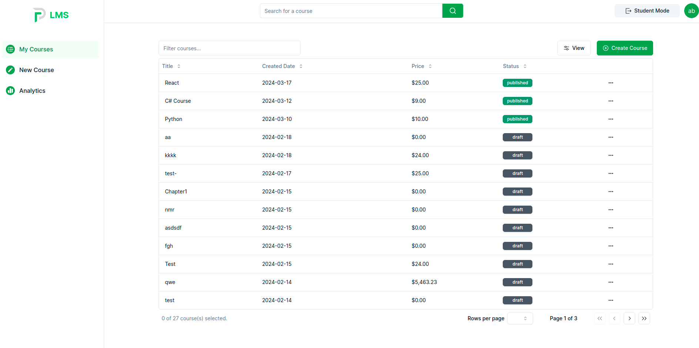
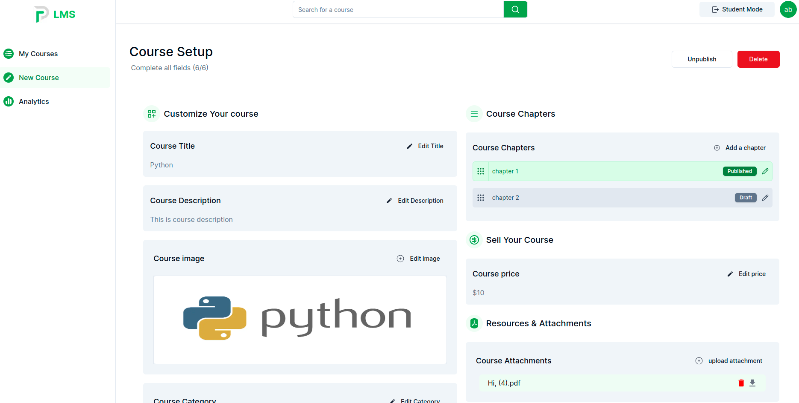

# Learning Management System


## App Url (Vercel):

[https://lms-theta-ecru.vercel.app/](https://lms-theta-ecru.vercel.app/)

`List pf Courses: `


`Setup `


## Technologies Used

- **Frontend Framework**: Next.js - server actions
- **Styling**: Tailwind CSS
- **ORM**: Prisma ORM
- **Database**: MongoDB
- **Authentication**: NextAuth.js
- **Data Fetching and Query**: SWR
- **State Management**: Zustand
- **UI Components**: Shadcn
- **Stripe**: Payment
- **Mux**: Video Hosting
- **Resend**: Email Provider
- **AWS S3**: File Handler

## Environment Variables

```
NODE_ENV="development"
DATABASE_URL="mongodb+srv://<username>:<password>@<cluster>/<database>"
AUTH_SECRET=<your_auth_secret_key>

# Auth Providers
GITHUB_CLIENT_ID=<your_github_client_id>
GITHUB_CLIENT_SECRET=<your_github_client_secret>
GOOGLE_CLIENT_ID=<your_google_client_id>
GOOGLE_CLIENT_SECRET=<your_google_client_secret>

# Email Providers
NEXT_PUBLIC_FROM_EMAIL=<your_from_email>
NEXT_PUBLIC_RESEND_API_KEY=<your_resend_api_key>

# AWS S3
AWS_ACCESS_KEYY=<your_aws_access_key>
AWS_SECRET_ACCESS_KEYY=<your_aws_secret_access_key>
AWS_BUCKET_NAMEE=<your_aws_bucket_name>
AWS_BUCKET_REGIONN=<your_aws_bucket_region>

# Mux
MUX_TOKEN_ID=<your_mux_token_id>
MUX_SECRET_KEY=<your_mux_secret_key>

# App URLs
NEXT_PUBLIC_APP_MAIN_URL=<your_app_main_url>
NEXT_PUBLIC_APP_URL=<your_app_url>

# Stripe
STRIPE_PUBLISHED_KEY=<your_stripe_published_key>
STRIPE_SECRET_KEY=<your_stripe_secret_key>
STRIPE_WEBHOOK_SECRET=<your_stripe_webhook_secret>

```

## Getting Started

1. **Clone the repository:**

   ```bash
   git clone https://github.com/your-username/lms.git
   ```

2. **Install dependencies:**

   ```bash
   cd lms
   npm install
   ```

3. **Set up the environment variables:**

   Create a `.env` file based on the provided template and set up the required environment variables.

4. **Run the development server:**

   ```bash
   npm run dev
   ```

5. **Open the Application:**

   Open [http://localhost:3000](http://localhost:3000) in your browser to see the application.

## Folder Structure

```
- src
  - actions: Contains server actions.
  - app: Main routes of the application.
    - auth: Authentication-related routes.
    - main: Main routes of the application.
  - api/auth/[...nextauth]: NextAuth.js authentication endpoint.
- components: Reusable UI components.
- const: Constants and configurations.
- hooks: Custom React hooks.
- lib: Utility functions and libraries.
- schemas: Prisma ORM schemas.
```
